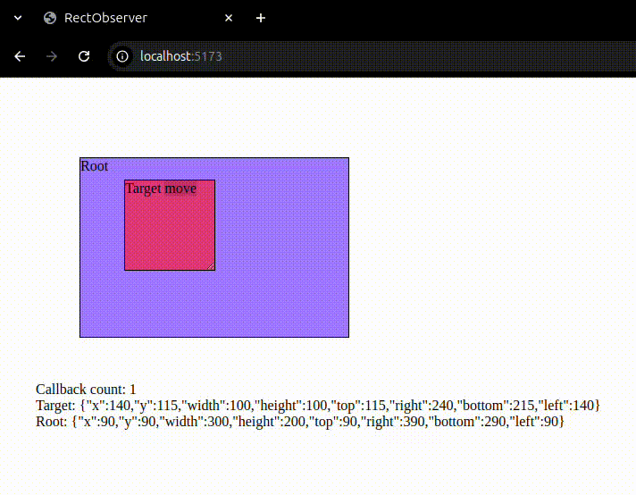

# RectObserver

Executes a callback every time the bounding rect of the element changes. It uses IntersectionObserver under the hood, so there's no check loop.

## Example



```ts
// Full example in src/main.ts

// Just for testing, the cause of the element's rect change doesn't matter.
configureSlider(target, root, handler);

let counter = 0;
const callback: RectObserverCallback = () => {
  counter++;
  textDisplay.innerHTML = `Callback count: ${counter}`;
  textDisplay.innerHTML += `<br>Target: ${JSON.stringify(
    target.getBoundingClientRect()
  )}`;
  textDisplay.innerHTML += `<br>Root: ${JSON.stringify(
    root.getBoundingClientRect()
  )}`;
};

const rectObserver = new RectObserver(callback, target, root);

// If required disconnect the observer
// rectObserver.disconnect();
```

## Contributing

If you want to contribute to the library, feel free to contact me via email: yolisses0 at gmail dot com.
